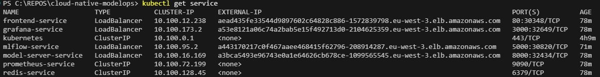
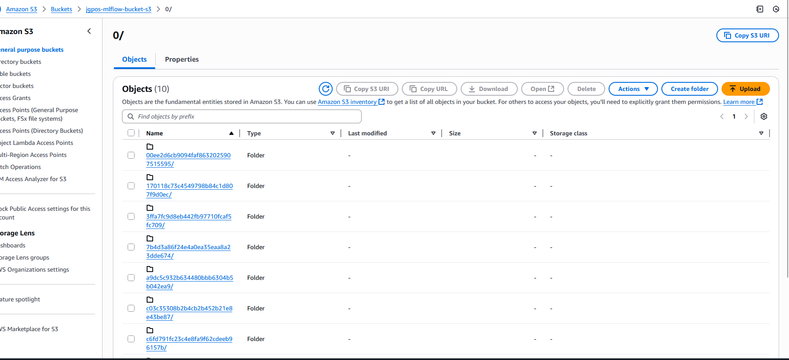
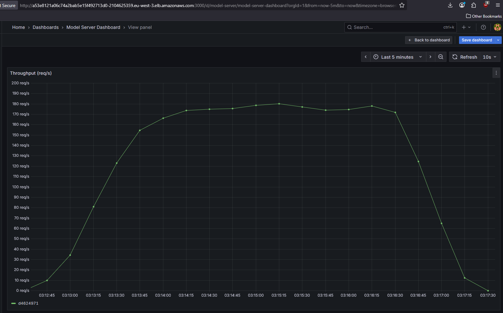
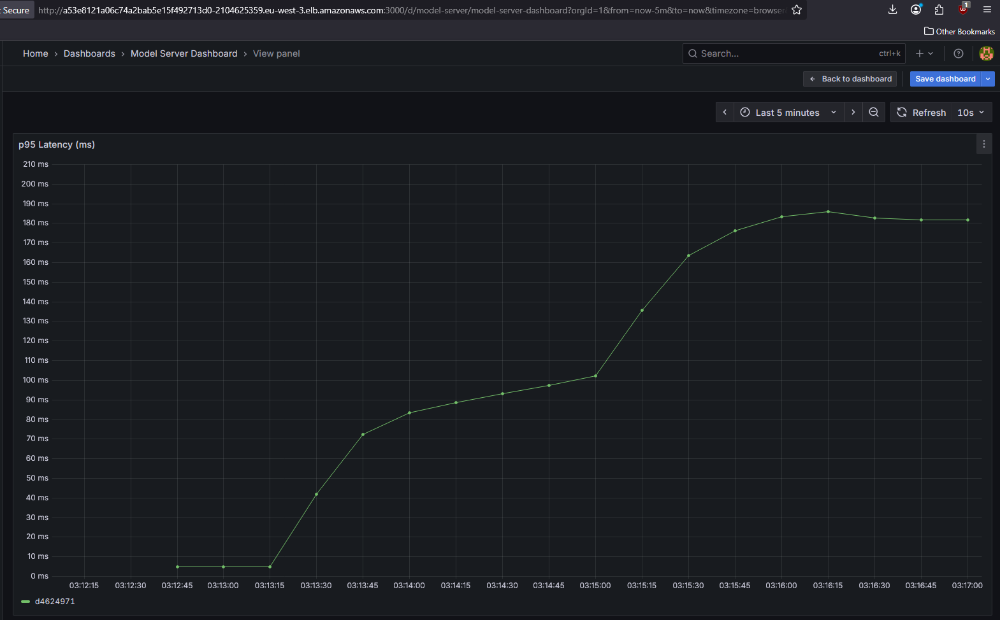

# Cloud-Native ModelOps Platform

This project contains the Kubernetes manifests and Helm chart for deploying a MLOps platform. It takes the services from the [ModelOps Studio](https://github.com/Joao-Gabriel-Santos00/modelops-studio) project and packages them for a cloud environment.

The project demonstrates two key deployment targets:
1.  A **local deployment** on Docker Desktop, using MinIO for S3-compatible storage.
2.  A **cloud deployment** on **Amazon EKS**, using a native **Amazon S3** bucket and secure IAM roles for pod authentication.

The final deliverable is a configurable Helm chart that can deploy the entire stack to either environment.

## Why I Built This Project

I built this project to demonstrate the full lifecycle of a ML system, from local development to cloud deployment. The core challenge was to move beyond a `docker-compose` setup and adapt the project for **Kubernetes**.

## Architecture

The platform is designed as a set of microservices orchestrated by Kubernetes. For cloud deployments, the MinIO object store is disabled and replaced by a native AWS S3 bucket, with pods securely authenticating via IAM Roles for Service Accounts (IRSA).

## Key Features & Concepts

*   **Cloud & Local Deployment:** The Helm chart is configurable to deploy the entire stack to both a local Kubernetes cluster and a cloud provider (**Amazon EKS**).
*   **Infrastructure as Code (IaC):** The entire application and its configurations are packaged into a **Helm chart**. The cloud infrastructure itself was provisioned using **`eksctl`** declarative manifests.
*   **Cloud Service Integration:** Replaced the local MinIO object store with a managed **Amazon S3** bucket for model artifact storage in the cloud environment.
*   **Secure Cloud Authentication:** Implemented **IAM Roles for Service Accounts (IRSA)** to provide pods with secure, temporary, and fine-grained permissions to access AWS S3 without long-lived credentials.

## Getting Started (Local Deployment)

Follow these instructions to deploy the entire MLOps stack on your local machine for development and testing.

### Prerequisites

*   **Docker Desktop:** with the Kubernetes engine enabled.
*   **kubectl:** command-line tool for interacting with Kubernetes.
*   **Helm v3:** the package manager for Kubernetes.

### Local Deployment Steps

1.  **Deploy the MinIO Secret:**
    ```powershell
    kubectl apply -f kubernetes/minio-secret.yml
    ```
2.  **Install the Helm Chart:** This command uses the default `values.yaml` for a local setup.
    ```powershell
    helm install modelops ./modelops-stack/
    ```
3.  **Verify the Deployment:**
    ```powershell
    kubectl get pods -w
    ```
    Once all pods are `Running`, the platform is ready. The services can be accessed via the `NodePort` addresses listed in `values.yaml` (e.g., `http://localhost:30081/docs`).

---

## Cloud Deployment & Performance (AWS EKS)

To validate the platform's production readiness, the Helm chart was deployed to **Amazon EKS**. The MinIO component was disabled, and a native **Amazon S3** bucket was used for artifact storage.

### Cloud Deployment Proof

The following screenshot shows the public endpoints created by AWS Elastic Load Balancers for the deployed services:



Model artifacts were trained and stored in the S3 bucket, as shown in the AWS Console:



### Performance Under Load

A `k6` load test was executed against the public `model-server` endpoint on EKS. The platform demonstrated stability with a **0.00% error rate** while sustaining an average of **~152 requests/second**.

The Grafana dashboard below shows the key performance indicators (Throughput, p95 Latency) during the peak of the 4-minute load test.

**Throughput (Requests per Second):**


**p95 Latency (milliseconds):**


Throughput was excellent and consistent, averaging **152 requests/second** on the AWS EKS cluster, slightly exceeding the local performance. The p95 latency increased from 180ms to ~524ms, which is an expected and acceptable trade-off resulting from real-world network overhead and the AWS Load Balancer layer. This confirms the application's architecture is robust and performs as expected under a realistic, simulated load. You can see the original local test results in the [ModelOps Studio project README](https://github.com/Joao-Gabriel-Santos00/modelops-studio) for a direct comparison.

### k6 Load Test Results (Cloud)
  █ TOTAL RESULTS

    checks_total.......: 75890   303.477737/s
    checks_succeeded...: 100.00% 75890 out of 75890
    checks_failed......: 0.00%   0 out of 75890

    ✓ status is 200
    ✓ response contains prediction

    HTTP
    http_req_duration..............: avg=281.47ms min=36.74ms med=277.1ms  max=869.86ms p(90)=462.18ms p(95)=523.86ms
      { expected_response:true }...: avg=281.47ms min=36.74ms med=277.1ms  max=869.86ms p(90)=462.18ms p(95)=523.86ms
      { type:predict }.............: avg=281.47ms min=36.74ms med=277.1ms  max=869.86ms p(90)=462.18ms p(95)=523.86ms
    http_req_failed................: 0.00%  0 out of 37945
    http_reqs......................: 37945  151.738869/s

    EXECUTION
    iteration_duration.............: avg=331.93ms min=86.99ms med=327.57ms max=920.31ms p(90)=512.6ms  p(95)=574.36ms
    iterations.....................: 37945  151.738869/s
    vus............................: 1      min=1          max=99
    vus_max........................: 100    min=100        max=100

    data_received..................: 9.3 MB 37 kB/s
    data_sent......................: 30 MB  119 kB/s


running (4m10.1s), 000/100 VUs, 37945 complete and 0 interrupted iterations
default ✓ [======================================] 000/100 VUs  4m10s


## Next Steps & Future Work

To further advance this project, the following areas would be tackled next:

*   **GitOps for CI/CD:** Integrate a GitOps tool like **ArgoCD** so when merging a change to the Helm chart in Git automatically triggers a deployment to the Kubernetes cluster.
*   **Automated Training Pipelines:** Integrate a workflow orchestrator like **Apache Airflow** (running on Kubernetes) to replace the manual `Job` file for training.